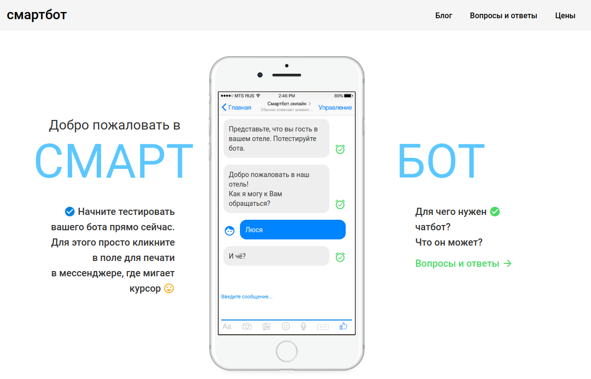

# Bot web client



## Installation using Docker

```bash
git clone git@github.com:mnvx/bot-web-client.git
cd onepage
docker build -t onepage .
```

Run docker container

```bash
docker run --rm -p 88:80 -t onepage
```

Then open [http://localhost:88/](http://localhost:88/)

## Installation using console

### Requirements

- Python 3
- npm
- ng

### Installation

Create configuration file and edit configuration:

```bash
cp backend/app_config.py.example backend/app_config.py
mcedit backend/app_config.py
```

For development:

```bash
make dev
```

For staging:

```bash
make staging
```

For production:

```bash
make production
```

# About frontend

This project was generated with [Angular CLI](https://github.com/angular/angular-cli) version 1.3.2.

## Development server

Run `ng serve` for a dev server. Navigate to `http://localhost:4200/`. The app will automatically reload if you change any of the source files.

## Code scaffolding

Run `ng generate component component-name` to generate a new component. You can also use `ng generate directive|pipe|service|class|guard|interface|enum|module`.

## Build

Run `ng build` to build the project. The build artifacts will be stored in the `dist/` directory. Use the `-prod` flag for a production build.

## Running unit tests

Run `ng test` to execute the unit tests via [Karma](https://karma-runner.github.io).

## Running end-to-end tests

Run `ng e2e` to execute the end-to-end tests via [Protractor](http://www.protractortest.org/).
Before running the tests make sure you are serving the app via `ng serve`.

## Further help

To get more help on the Angular CLI use `ng help` or go check out the [Angular CLI README](https://github.com/angular/angular-cli/blob/master/README.md).
